# Albion Place Hotel — Mobile-First Redesign Proposal

[](https://github.com/DKon109/Albion-Website/actions/workflows/ci.yml)

> **Status:** Independent redesign prototype — **not the official website**.
> The proposal is currently being reviewed with the venue and the external agency
> that maintains the production site.

- **Live prototype:** https://cheery-raindrop-388ad0.netlify.app/
- **Official production site:** https://albionplacehotel.com.au/

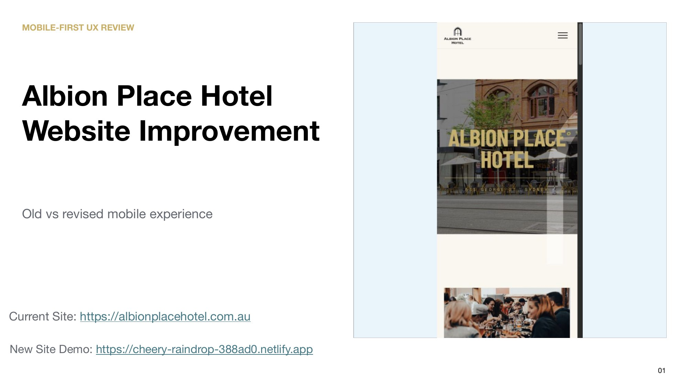

---

## Why this exists

The venue's production site works well on desktop but has several usability
problems on mobile — most critically, the food and lunch menus open as wide
landscape PDFs that are effectively unreadable on a phone. I rebuilt the site
as a working prototype so each proposed fix is concrete and testable, and I'm
using it — together with the side-by-side iPhone captures below — to discuss the
changes with the venue's web vendor.

Every comparison in this README is a **live iPhone capture (390 × 844 px)** of
the current production site (**Old Ver.**) next to this prototype (**New Ver.**).

## The redesign removes friction at three moments that matter

Mobile visitors should be able to **find, understand, and act** without
unnecessary taps or zooming.

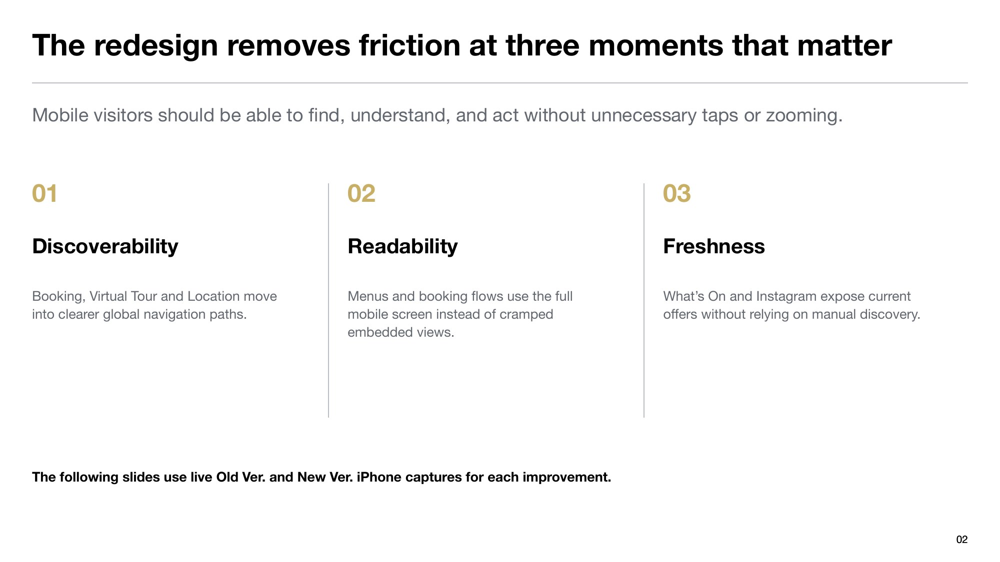

| # | Problem on the production site | Fix in this prototype | Type |
|---|---|---|---|
| 1 | "Book a table" appears only inside EAT, with three different button widths | Menu buttons share one size; booking moves to global navigation | Readability |
| 2 | Food & lunch menus open as wide PDFs — tiny and awkward to zoom on a phone | Device-aware routing to a full-screen, pinch-to-zoom menu viewer | Readability |
| 3 | Embedded booking form is too small; dates and fields are hard to read | Booking opens full-screen in a new tab | Readability |
| 4 | "What's On" promo banners are static; other offers stay unseen | Auto-rotating carousel keeps Previous/Next controls | Freshness |
| 5 | Oversized "Make a booking" / "Virtual Tour" blocks push content down | Compact global CTA below Contact; header access retained | Discoverability |
| 6 | Virtual Tour is buried at the bottom of a long scroll | Listed directly in the mobile menu | Discoverability |
| 7 | No live, self-updating content between menu refreshes | Official Instagram feed embedded on the homepage | Freshness |
| 8 | Address must be copied and searched to get directions | Location button + footer address open Google Maps directions in one tap | Discoverability |

---

## Discoverability — moving key actions into clear paths

### A compact global booking CTA supports conversion

**Old Ver.** the booking block is oversized, appears near the page end, and feels
disconnected. **New Ver.** a compact CTA sits below Contact, header access remains
available, and booking opens in a full-screen flow.

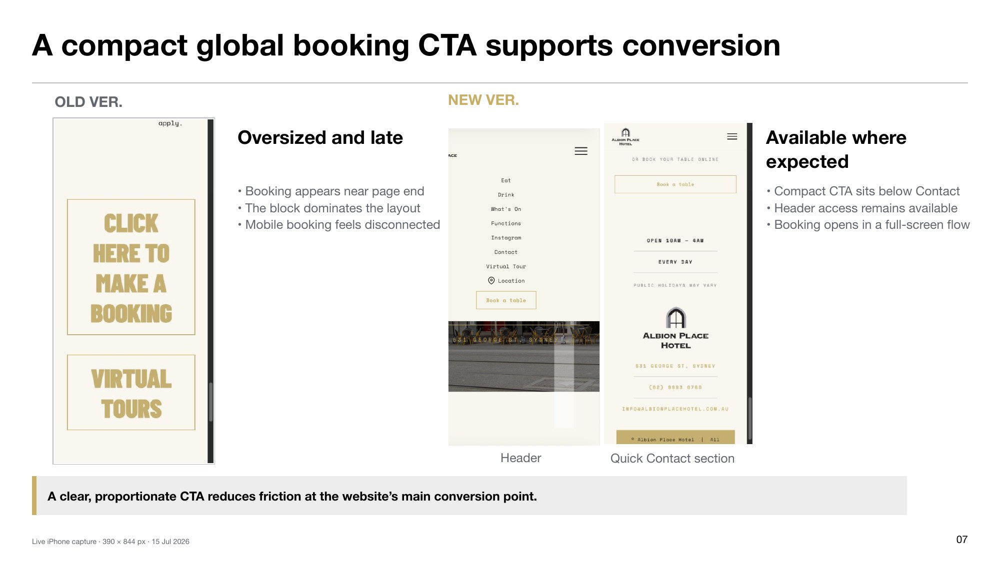

> A clear, proportionate CTA reduces friction at the website's main conversion point.

### Virtual Tour is easier to find without an oversized block

**Old Ver.** the tour is hidden at the bottom behind a long scroll, in a button much
larger than the rest. **New Ver.** it's listed directly in the menu with the same
visual hierarchy and opens in a dedicated full-screen view.

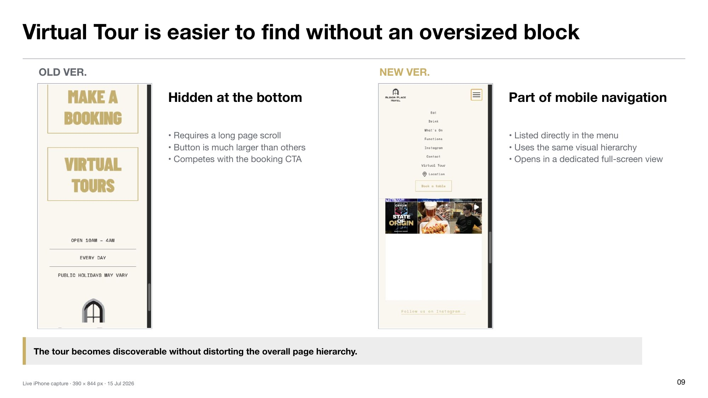

> The tour becomes discoverable without distorting the overall page hierarchy.

### Location shortcuts remove the need to copy and search

Tapping the **Location** menu item or the footer address opens Google Maps with
directions from the visitor's current location straight to 531 George St.

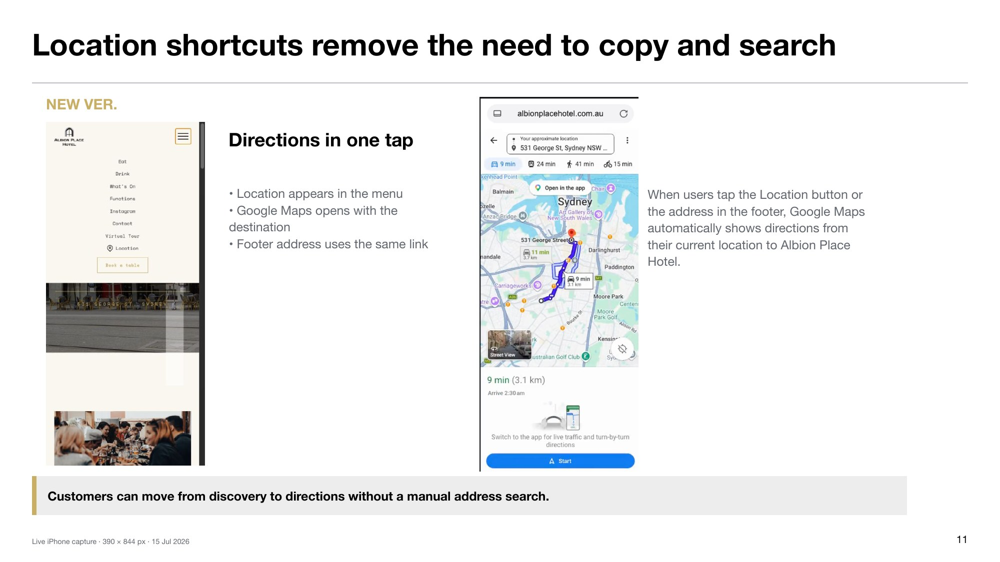

> Customers move from discovery to directions without a manual address search.

---

## Readability — using the full mobile screen

### Consistent CTAs make the Eat section easier to scan

**Old Ver.** an uneven hierarchy: three different button widths, booking only in EAT,
content and conversion actions competing. **New Ver.** menu buttons share one size,
booking moves to global navigation, and the section focuses on food content.

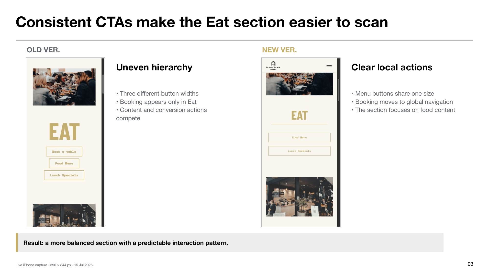

> A more balanced section with a predictable interaction pattern.

### Full-screen documents improve menu readability on iPhone

**Old Ver.** the menu PDF opens very small and text is difficult to inspect; iPhone
zooming feels awkward. **New Ver.** a dedicated document view uses the full browser
screen, supports pinch-to-zoom, and lets users return to the site easily. The PDF
asset is unchanged — the improvement is the mobile viewing and return flow.

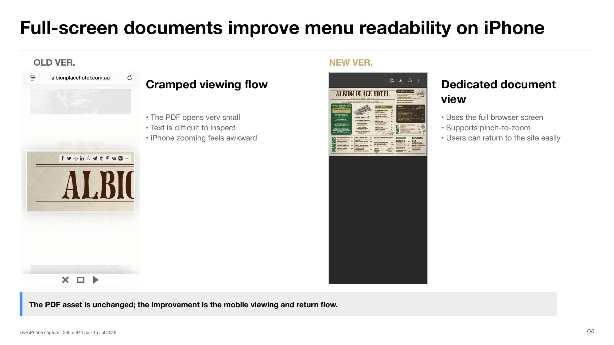

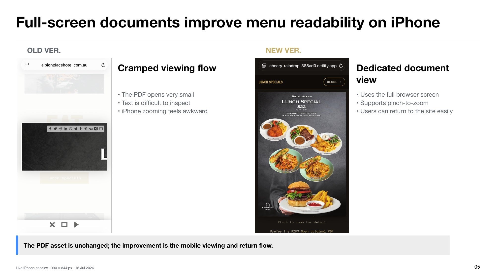

### A full-screen booking flow improves readability on iPhone

**Old Ver.** the embedded booking form is too small; dates and fields are hard to
read and zooming feels awkward. **New Ver.** booking opens in a new browser tab and
the form uses the full iPhone screen, so details and actions are easy to read.

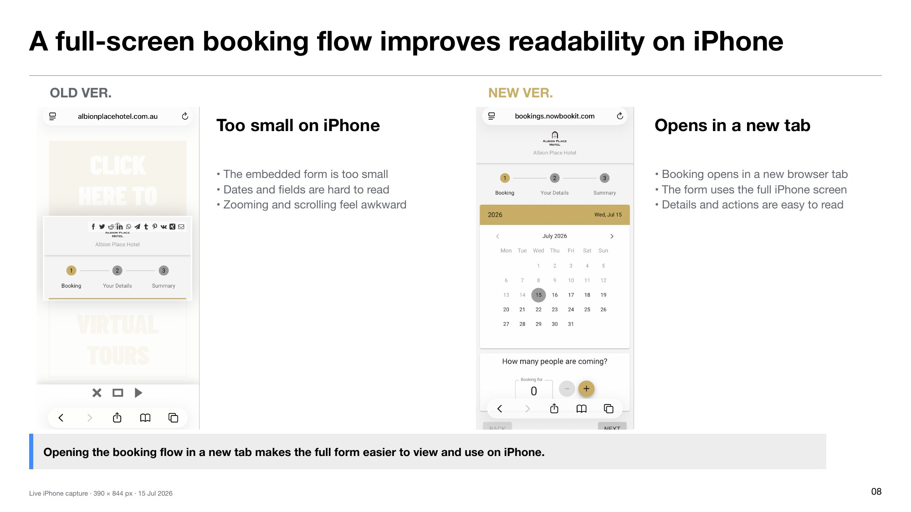

> Opening the booking flow in a new tab makes the full form easier to view and use on iPhone.

---

## Freshness — surfacing current offers automatically

### Auto-rotation exposes more offers without an extra tap

**Old Ver.** discovery depends on taps — the initial banners stay in view, users must
notice the arrows, and other offers can remain unseen. **New Ver.** the carousel
advances automatically while keeping Previous/Next controls, so more offers reach
passive visitors.

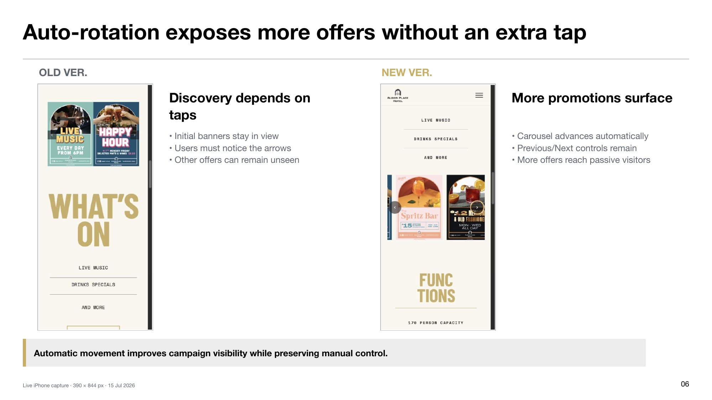

> Automatic movement improves campaign visibility while preserving manual control.

### Instagram keeps the site current between menu updates

The venue's most frequently updated channel is embedded on the homepage: official
posts appear on-site, recent events and offers stay visible, and direct links open
the full profile.

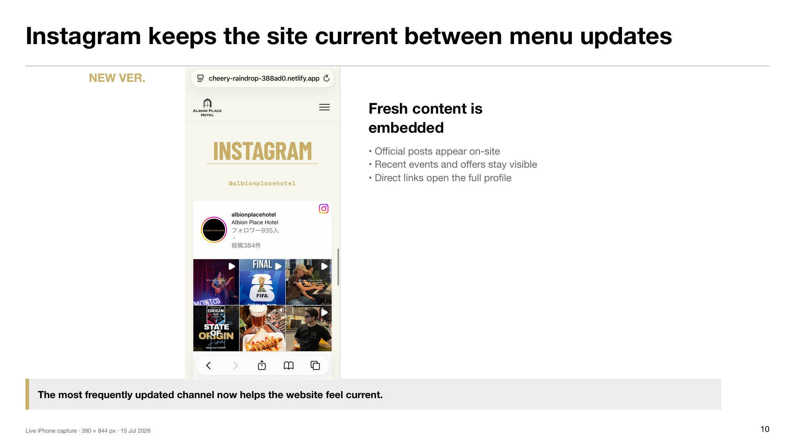

> The most frequently updated channel now helps the website feel current.

---

## Phase 2 — pending a venue asset handoff

These improvements are built and waiting on approved assets from the venue; they
are documented here rather than hidden.

### Drink menu completeness

**Old & New Ver.** the DRINK section lists Beer, Wine and Cocktails, but only *Classic
Cocktails* has a linked PDF. The revised build still ships one PDF.
**Next action:** obtain approved Beer and Wine PDFs, then publish all three menu links
beside Classic Cocktails.

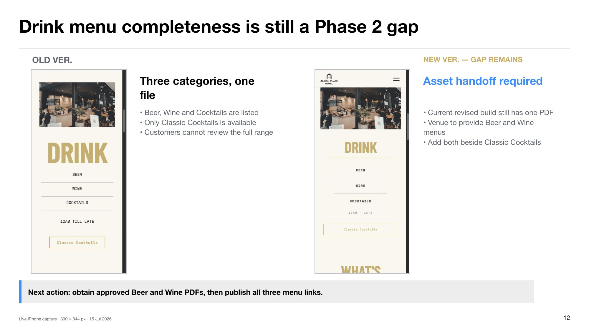

### Seasonal Winter Bar promo

The *Spritz Bar* banner in the carousel is a summer offer and no longer reflects the
current season. **Next action:** approve Winter Bar imagery and copy, then update the
carousel immediately.

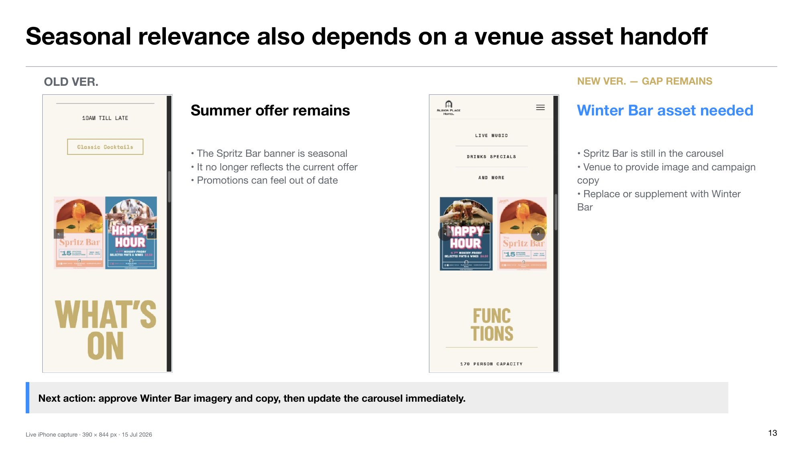

---

## Technical notes

- **Stack:** vanilla HTML / CSS / JS — no build step, deployable on any static host.
- **Mobile-first CSS** with breakpoints at 820 / 960 / 1080 px; design tokens
  matched to the production brand (`#c9ae66` gold, `#231f20` ink, `#f9f7ef` cream,
  Barlow Condensed + Space Mono).
- **Menu routing** ([scripts.js](scripts.js)): links keep their PDF `href` for
  desktop; below 820 px a click is rerouted to `menu-view.html?menu=food|lunch|cocktails`,
  which fits the menu image to the viewport and returns the user to the section
  they came from on close.
- **Booking & Location:** booking opens the third-party form in a new tab; the
  Location control and footer address share one Google Maps directions link.
- **SEO:** meta description, Open Graph / Twitter cards, `BarOrPub` JSON-LD
  structured data (address, hours, geo), `sitemap.xml`, `robots.txt`. Canonical
  URLs intentionally point at the official domain so this prototype never
  competes with the production site in search.
- **CI:** GitHub Actions runs `html-validate` on `index.html` and `menu-view.html`
  on every push and pull request.

## Running locally

```bash
python3 -m http.server 5174
# open http://localhost:5174/
```

## Project structure

```
index.html        Single-page site (hero, EAT, DRINK, What's On, Functions, Instagram, Contact)
menu-view.html    Mobile menu viewer (?menu=food|lunch|cocktails)
scripts.js        Smooth scrolling, device-aware menu routing, carousel autoplay
styles.css        Design tokens + responsive layout
assets/           Images and menu PDFs
docs/slides/      Old-vs-new iPhone capture comparisons used in this README
sitemap.xml
robots.txt
```

## Disclaimer

This repository is an **independent redesign proposal** created to demonstrate
and discuss concrete improvements with Albion Place Hotel and its web vendor.
It is not the official website. All brand assets (logo, menus, photography)
belong to Albion Place Hotel and are used here solely in the context of that
proposal.
